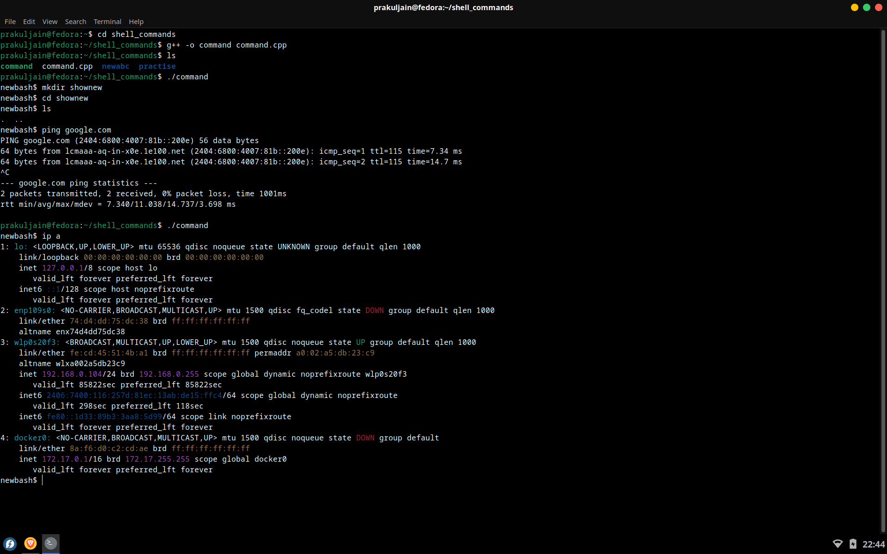

# 🐚 Custom Shell Commands in C++

A lightweight Linux shell clone written in C++. This custom shell (`newbash$`) provides basic shell functionalities like file navigation, permission changes, process management, and more—built entirely using system-level C++ APIs.

## 🚀 Features

- ✅ Custom prompt: `newbash$`
- 📂 Directory navigation: `cd`, `cd ~`, `cd -`
- 📄 File & directory operations: `ls`, `mkdir`, `rm`, `mv`, `cp`
- 🔐 Permission modification: `chmod`
- ⚙️ Package manager passthrough: `apt`, `dnf`, `yum`, `pacman`, `zypper`
- 📡 Network and system commands: `ping`, `ip a`, `wget`, `mount`, `df`, `du`, `lsblk`
- 🛑 Exit via `exit` command
- 🧠 Executes real Linux commands using `fork()` and `execvp()`

## 🧩 Commands Supported

| Command   | Description                          |
|-----------|--------------------------------------|
| `cd`      | Change directory                     |
| `ls`      | List files in a directory            |
| `chmod`   | Change file permissions              |
| `mkdir`   | Create a new directory               |
| `rm`      | Remove a file                        |
| `mv`      | Move or rename a file                |
| `cp`      | Copy a file or directory             |
| `exit`    | Exit the shell                       |
| `apt`, `dnf`, etc. | Package manager passthrough |
| `ping`, `wget`, `nvim`, `ip a`, etc. | System tool passthrough |

## 🛠️ How It Works

Internally uses:

- `fork()` to create a child process
- `execvp()` to replace the child with an actual command
- `waitpid()` to sync with parent
- `getcwd()`, `chdir()`, `chmod()`, `mkdir()`, `remove()`, `rename()`, and more from `unistd.h`, `sys/stat.h`, etc.

## 📸 Screenshots:


---

## 📦 Compilation

```bash
g++ -o command command.cpp
./command
